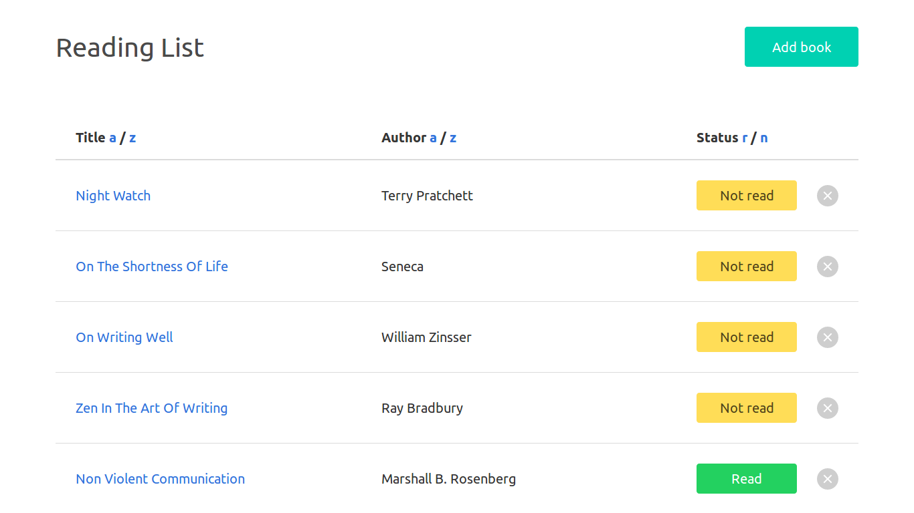

# React Reading List

React version of a simple reading list [initially written in vanilla JS](https://github.com/lujanfernaud/js-reading-list).

## Built With

- [React 16](https://reactjs.org/)
- [Local Storage](https://developer.mozilla.org/en-US/docs/Web/API/Storage/LocalStorage)
- [Bulma](https://bulma.io/)

## Screenshot

<kbd>
  
</kbd>

## Notes

You can reset the list of books by typing `localStorage.clear()` in the browser's console and refreshing the page, or by deleting all books manually.
